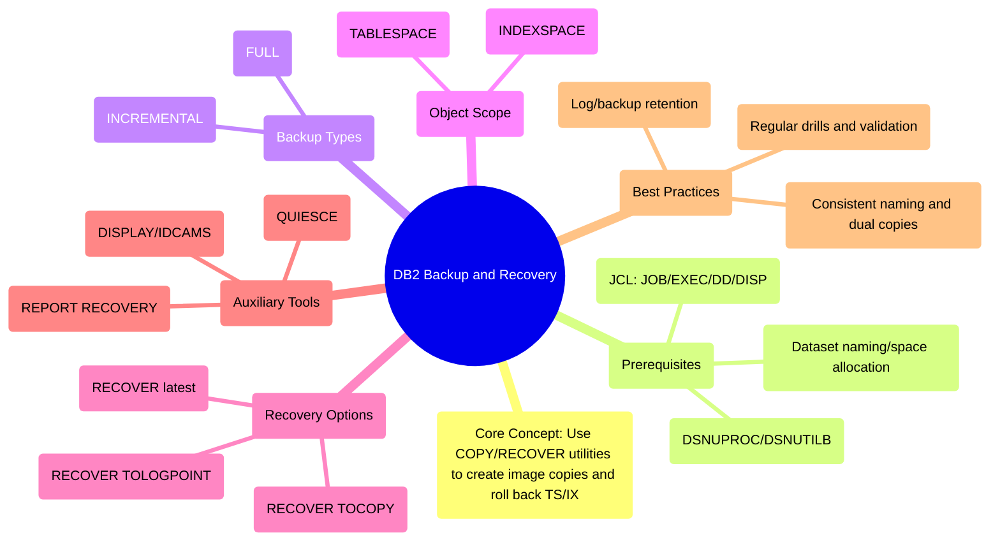

# DB2 Backup and Recovery Operations Wiki (with complete JCL templates)

> Goal: Provide operators/DBAs with a hands-on guide for **how to perform backup and recovery** in DB2 for z/OS, covering **tablespaces** and  **indexspaces** ; include **full/incremental copies** and multiple recovery options (latest, TOCOPY, point-in-time). Complete JCL templates are included.

---

## 1.Global Mindmap



---

## 2. Terminology and Conventions

* **TS (TABLESPACE)** : Main object for COPY/RECOVER.
* **IX (INDEXSPACE)** : Index objects, can be copied or rebuilt after recovery.
* **FULL/INCR** : Full vs incremental image copies.
* **TOCOPY/TOLOGPOINT** : Restore to a specific image copy / log point (RBA/LSN).
* **SYSPRINT** : Utility log output.

---

## 3. Common Variables (set once, reuse everywhere)

```jcl
//* ====== COMMON SYMBOLS ======
/* SET HLQ=MYDB                 /* High-level qualifier for datasets   */
/* SET SUBSYS=DSN1              /* Db2 subsystem                      */
/* SET DBNAME=LAB01             /* Database name                      */
/* SET TSNAME=TSLAB01           /* Tablespace name (example)          */
/* SET IXNAME=IXLAB01           /* Indexspace name (example)          */
/* SET UNIT=SYSDA               /* Device                             */
/* SET PRI=10,SEC=1             /* Primary/secondary space allocation */
/* SET UID=BKUP                 /* Utility job UID                    */
/* SET TAG=Y20250928.T120000    /* Timestamp tag                      */
/* SET PARALLEL=2               /* Parallelism                        */
/* SET COPY1=SYSCOPY            /* Primary copy DD name               */
/* SET COPY2=SYSCOPY2           /* Secondary copy DD name             */
/* SET RCOPY1=COPYR1            /* Remote primary copy DD name        */
/* SET RCOPY2=COPYR2            /* Remote secondary copy DD name      */
```

---

## 4. Backup (COPY) templates

### 4.1 Tablespace — Full copy (FULL)

```jcl
//FULLTS  EXEC DSNUPROC,SYSTEM=&SUBSYS,UID='&UID'
//&COPY1  DD DSN=&HLQ..COPY.&TSNAME..FULL.&TAG,
//          DISP=(NEW,CATLG,DELETE),UNIT=&UNIT,
//          SPACE=(CYL,(&PRI,&SEC))
//&COPY2  DD DSN=&HLQ..COPY.&TSNAME..FULL.&TAG..BKP,
//          DISP=(NEW,CATLG,DELETE),UNIT=&UNIT,
//          SPACE=(CYL,(&PRI,&SEC))
//&RCOPY1 DD DSN=&HLQ..RCOPY.&TSNAME..FULL.&TAG,
//          DISP=(NEW,CATLG,DELETE),UNIT=&UNIT,
//          SPACE=(CYL,(&PRI,&SEC))
//&RCOPY2 DD DSN=&HLQ..RCOPY.&TSNAME..FULL.&TAG..BKP,
//          DISP=(NEW,CATLG,DELETE),UNIT=&UNIT,
//          SPACE=(CYL,(&PRI,&SEC))
//SYSPRINT DD SYSOUT=*
//SYSIN    DD *
  COPY TABLESPACE &DBNAME..&TSNAME
       FULL YES                /* full copy */
       SHRLEVEL CHANGE          /* allow read and write during copy */
       PARALLEL &PARALLEL
       COPYDDN(&COPY1,&COPY2)
       RECOVERYDDN(&RCOPY1,&RCOPY2)
/*
```

### 4.2 Tablespace — Incremental copy (INCR)

```jcl
//INCRTS  EXEC DSNUPROC,SYSTEM=&SUBSYS,UID='&UID'
//&COPY1  DD DSN=&HLQ..COPY.&TSNAME..INCR.&TAG,
//          DISP=(NEW,CATLG,DELETE),UNIT=&UNIT,
//          SPACE=(CYL,(&PRI,&SEC))
//SYSPRINT DD SYSOUT=*
//SYSIN    DD *
  COPY TABLESPACE &DBNAME..&TSNAME
       FULL NO                 /* incremental copy, requires a full baseline */
       SHRLEVEL REFERENCE       /* allow read, block write */
       PARALLEL &PARALLEL
       COPYDDN(&COPY1)
/*
```

### 4.3 Indexspace — Full copy

```jcl
//FULLIX  EXEC DSNUPROC,SYSTEM=&SUBSYS,UID='&UID'
//&COPY1  DD DSN=&HLQ..COPY.&IXNAME..FULL.&TAG,
//          DISP=(NEW,CATLG,DELETE),UNIT=&UNIT,
//          SPACE=(CYL,(&PRI,&SEC))
//SYSPRINT DD SYSOUT=*
//SYSIN    DD *
  COPY INDEXSPACE &DBNAME..&IXNAME
       FULL YES                /* full copy */
       SHRLEVEL CHANGE          /* allow read and write during copy */
       PARALLEL &PARALLEL
       COPYDDN(&COPY1)
/*
```

---

## 5. Recovery (RECOVER) templates

### 5.1 Recover to latest consistent state

```jcl
//RECTSNEW EXEC DSNUPROC,SYSTEM=&SUBSYS,UID='&UID'
//SYSPRINT DD SYSOUT=*
//SYSIN    DD *
  RECOVER TABLESPACE &DBNAME..&TSNAME
/*
```

### 5.2 Recover to a specific copy (TOCOPY)

```jcl
//RECTSCOP EXEC DSNUPROC,SYSTEM=&SUBSYS,UID='&UID'
//SYSPRINT DD SYSOUT=*
//SYSIN    DD *
  RECOVER TABLESPACE &DBNAME..&TSNAME
          TOCOPY &HLQ..COPY.&TSNAME..FULL.&TAG
/*
```

### 5.3 Point-in-time recovery (TOLOGPOINT)

```jcl
/* SET RBA=X'001122334455'
//RECTSPIT EXEC DSNUPROC,SYSTEM=&SUBSYS,UID='&UID'
//SYSPRINT DD SYSOUT=*
//SYSIN    DD *
  RECOVER TABLESPACE &DBNAME..&TSNAME
          TOLOGPOINT &RBA
/*
```

### 5.4 Indexspace recovery (if copied)

```jcl
//RECIX   EXEC DSNUPROC,SYSTEM=&SUBSYS,UID='&UID'
//SYSPRINT DD SYSOUT=*
//SYSIN    DD *
  RECOVER INDEXSPACE &DBNAME..&IXNAME
/*
```

### 5.5 Rebuild indexes (if not copied)

```jcl
//REBLDIX EXEC DSNUPROC,SYSTEM=&SUBSYS,UID='&UID'
//SYSPRINT DD SYSOUT=*
//SYSIN    DD *
  REBUILD INDEX (ALL) TABLESPACE &DBNAME..&TSNAME
/*
```

---

## 6. Auxiliary utilities

### 6.1 Generate recovery report

```jcl
//RPTRECOV EXEC DSNUPROC,SYSTEM=&SUBSYS,UID='&UID'
//SYSPRINT DD SYSOUT=*
//SYSIN    DD *
  REPORT RECOVERY TABLESPACE &DBNAME..&TSNAME
/*
```

### 6.2 Create consistency point (QUIESCE)

```jcl
//QUIESCE EXEC PGM=DSNUTILB,PARM='&SUBSYS,QUIESCE'
//SYSPRINT DD SYSOUT=*
//SYSIN    DD *
  QUIESCE TABLESPACE &DBNAME..&TSNAME WRITE YES
/*
```

### 6.3 Display object status

```jcl
//DISPSTAT EXEC PGM=DSNTIAUL,COND=(0,NE)
//SYSPRINT DD SYSOUT=*
//SYSIN    DD *
  DISPLAY DATABASE(&DBNAME) SPACENAM(*)
/*
```

### 6.4 OS-level dataset inventory

```jcl
//LISTCAT  EXEC PGM=IDCAMS
//SYSPRINT DD SYSOUT=*
//SYSIN    DD *
  LISTCAT LEVEL(&HLQ..COPY.&TSNAME)
/*
```

---

## 7. Example: multi-object batch

```jcl
//FULL1   EXEC DSNUPROC,SYSTEM=&SUBSYS,UID='&UID'
//SYSCOPY1 DD DSN=&HLQ..COPY.TSLAB01.FULL.&TAG,DISP=(NEW,CATLG,DELETE),UNIT=&UNIT,SPACE=(CYL,(&PRI,&SEC))
//SYSPRINT DD SYSOUT=*
//SYSIN    DD *
  COPY TABLESPACE &DBNAME..TSLAB01 FULL YES SHRLEVEL CHANGE
/*
//FULL2   EXEC DSNUPROC,SYSTEM=&SUBSYS,UID='&UID'
//SYSCOPY2 DD DSN=&HLQ..COPY.TSLAB02.FULL.&TAG,DISP=(NEW,CATLG,DELETE),UNIT=&UNIT,SPACE=(CYL,(&PRI,&SEC))
//SYSPRINT DD SYSOUT=*
//SYSIN    DD *
  COPY TABLESPACE &DBNAME..TSLAB02 FULL YES SHRLEVEL CHANGE
/*
//RPT1    EXEC DSNUPROC,SYSTEM=&SUBSYS,UID='&UID'
//SYSPRINT DD SYSOUT=*
//SYSIN    DD *
  REPORT RECOVERY TABLESPACE &DBNAME..TSLAB01
  REPORT RECOVERY TABLESPACE &DBNAME..TSLAB02
/*
```

---

## 8. Integrated flow with QUIESCE and 90-day cleanup

### 8.1 Single tablespace

```jcl
//QUIESCE  EXEC PGM=DSNUTILB,PARM='&SUBSYS,QUIESCE'
//SYSPRINT DD SYSOUT=*
//SYSIN    DD *
  QUIESCE TABLESPACE &DBNAME..&TSNAME WRITE YES
/*
//FULLCOPY EXEC DSNUPROC,SYSTEM=&SUBSYS,UID='BKUP.FULL'
//&COPY1   DD DSN=&HLQ..COPY.&TSNAME..FULL.&TAG,
//            DISP=(NEW,CATLG,DELETE),UNIT=&UNIT,
//            SPACE=(CYL,(&PRI,&SEC))
//SYSPRINT DD SYSOUT=*
//SYSIN    DD *
  COPY TABLESPACE &DBNAME..&TSNAME
       FULL YES SHRLEVEL CHANGE
       PARALLEL &PARALLEL
       COPYDDN(&COPY1)
/*
//MODRCOV  EXEC DSNUPROC,SYSTEM=&SUBSYS,UID='BKUP.MODRCV'
//SYSPRINT DD SYSOUT=*
//SYSIN    DD *
  MODIFY RECOVERY TABLESPACE &DBNAME..&TSNAME DELETE AGE(90)
/*
```

### 8.2 Multi-object (LISTDEF)

```jcl
//QUIESCE  EXEC PGM=DSNUTILB,PARM='&SUBSYS,QUIESCE'
//SYSPRINT DD SYSOUT=*
//SYSIN    DD *
  QUIESCE DATABASE &DBNAME SPACENAM(*) WRITE YES
/*
//COPYLIST EXEC DSNUPROC,SYSTEM=&SUBSYS,UID='LIST.COPY.FULL'
//&COPY1   DD DSN=&HLQ..COPY.LIST.FULL.&TAG,
//            DISP=(NEW,CATLG,DELETE),UNIT=&UNIT,SPACE=(CYL,(&PRI,&SEC))
//SYSPRINT DD SYSOUT=*
//SYSIN    DD *
  LISTDEF L_MIXED_SCHEMA
    INCLUDE TABLESPACE DATABASE &DBNAME TABLESPACE STR%
    INCLUDE TABLESPACE DATABASE &DBNAME TABLESPACE ABC%
    INCLUDE INDEXSPACE DATABASE &DBNAME INDEXSPACE UDS%
    INCLUDE INDEXSPACE DATABASE &DBNAME INDEXSPACE EMO%
    INCLUDE INDEXSPACE DATABASE &DBNAME INDEXSPACE XYZ%
    ALL
  COPY LIST L_MIXED_SCHEMA FULL YES SHRLEVEL CHANGE
       PARALLEL &PARALLEL
       COPYDDN(&COPY1)
/*
//MODRCOV  EXEC DSNUPROC,SYSTEM=&SUBSYS,UID='LIST.MODRCV'
//SYSPRINT DD SYSOUT=*
//SYSIN    DD *
  MODIFY RECOVERY LIST L_MIXED_SCHEMA DELETE AGE(90)
/*
```

---

## 9. Common issues and solutions

| Issue                             | Meaning                       | Action                                                                   |
| --------------------------------- | ----------------------------- | ------------------------------------------------------------------------ |
| `NO IMAGE COPY DATA SETS FOUND` | No usable image copy found    | Check if a FULL copy exists, dataset still cataloged, naming correct     |
| `UNABLE TO ALLOCATE DATASET`    | Cannot allocate dataset       | Verify UNIT/SPACE/authority; check for catalog conflicts                 |
| `LOG NOT AVAILABLE`             | Missing required log data     | Verify archive logs are available; if not, only TOCOPY recovery possible |
| Post-recovery slow queries        | Indexes missing or fragmented | Run `REBUILD INDEX`or `REORG`                                        |
| Object in `COPY PENDING`        | Pending copy required         | Run FULL COPY immediately; or use `REPAIR ... NOCOPYPEND`with caution  |

---

## 10. Best practices

* **Naming convention** : `&HLQ..COPY.&TS/IX..{FULL|INCR}.&TAG` with timestamp tag.
* **Dual/local+remote copies** : Use `COPYDDN/RECOVERYDDN` for redundancy.
* **Incremental strategy** : Run FULL periodically, INCR in between.
* **Log retention** : Ensure archive logs cover your recovery window; run `MODIFY RECOVERY` regularly to purge old entries.
* **Regular drills** : Test `RECOVER` regularly; keep SYSPRINT for audit.

---

## 11. Appendix: Index rebuild vs index copy

* If rebuild cost is acceptable, prefer **REBUILD INDEX** after data recovery (simpler, robust).
* If indexes are huge and rebuild is costly, use `COPY INDEXSPACE` and `RECOVER INDEXSPACE`.

---

---

## 12. One‑stop templates: Whole database backup & recovery (with QUIESCE and 90‑day cleanup)

> These templates back up **all tablespaces under a database** (and optionally all indexspaces), using `LISTDEF`. They also include **QUIESCE** before copy and **MODIFY RECOVERY ... AGE(90)** afterward. Adjust the HLQ/space to your site standards.

### 12.1 Common symbols

```jcl
//* ====== COMMON SYMBOLS (database-wide) ======
/* SET SUBSYS=DSN1
/* SET DBNAME=LAB01                 /* database to process                  */
/* SET HLQ=MYDB                     /* dataset HLQ                          */
/* SET TAG=Y20250929.T010000        /* timestamp tag for datasets           */
/* SET UNIT=SYSDA                   /* storage unit                         */
/* SET PRI=50,SEC=10                /* space allocation (cyl)               */
/* SET PARALLEL=2                   /* utility parallelism                  */
/* SET COPY1=SYSCOPY                /* primary copy DD name                 */
```

### 12.2 QUIESCE the whole database (consistency point)

```jcl
//QUIESCE  EXEC PGM=DSNUTILB,PARM='&SUBSYS,QUIESCE'
//SYSPRINT DD SYSOUT=*
//SYSIN    DD *
  QUIESCE DATABASE &DBNAME SPACENAM(*) WRITE YES
/*
```

### 12.3 FULL backup of the whole database (all tablespaces; optional all indexspaces)

```jcl
//COPYDB  EXEC DSNUPROC,SYSTEM=&SUBSYS,UID='DB.COPY.FULL'
//&COPY1  DD DSN=&HLQ..COPY.&DBNAME..FULL.&TAG,
//          DISP=(NEW,CATLG,DELETE),UNIT=&UNIT,SPACE=(CYL,(&PRI,&SEC))
//SYSPRINT DD SYSOUT=*
//SYSIN    DD *
  LISTDEF L_DB_BACKUP
    INCLUDE TABLESPACE DATABASE &DBNAME          /* add all tablespaces under DB */
    /* INCLUDE INDEXSPACE DATABASE &DBNAME      /* <- uncomment to copy indexspaces too */
    ALL                                         /* include LOB/XML aux objects */
  COPY LIST L_DB_BACKUP
       FULL YES                                  /* full image copy */
       SHRLEVEL CHANGE                            /* allow read/write during copy */
       PARALLEL &PARALLEL
       COPYDDN(&COPY1)
/*
```

### 12.4 INCREMENTAL backup of the whole database (requires full baseline)

```jcl
//INCRDB  EXEC DSNUPROC,SYSTEM=&SUBSYS,UID='DB.COPY.INCR'
//&COPY1  DD DSN=&HLQ..COPY.&DBNAME..INCR.&TAG,
//          DISP=(NEW,CATLG,DELETE),UNIT=&UNIT,SPACE=(CYL,(&PRI,&SEC))
//SYSPRINT DD SYSOUT=*
//SYSIN    DD *
  LISTDEF L_DB_BACKUP
    INCLUDE TABLESPACE DATABASE &DBNAME
    /* INCLUDE INDEXSPACE DATABASE &DBNAME */
    ALL
  COPY LIST L_DB_BACKUP
       FULL NO                                   /* incremental image copy */
       SHRLEVEL REFERENCE                         /* allow read, block write */
       PARALLEL &PARALLEL
       COPYDDN(&COPY1)
/*
```

### 12.5 Cleanup: remove history older than 90 days (database-wide)

```jcl
//MODRCOV EXEC DSNUPROC,SYSTEM=&SUBSYS,UID='DB.MODREC'
//SYSPRINT DD SYSOUT=*
//SYSIN    DD *
  MODIFY RECOVERY DATABASE &DBNAME DELETE AGE(90)
/*
```

### 12.6 Recover the whole database to latest consistent state

```jcl
//RCVDB   EXEC DSNUPROC,SYSTEM=&SUBSYS,UID='DB.RECOVER'
//SYSPRINT DD SYSOUT=*
//SYSIN    DD *
  LISTDEF L_DB_BACKUP
    INCLUDE TABLESPACE DATABASE &DBNAME
    /* INCLUDE INDEXSPACE DATABASE &DBNAME */
    ALL
  RECOVER LIST L_DB_BACKUP
/*
```

### 12.7 Point‑in‑time recovery for the whole database

```jcl
/* SET RBA=X'001122334455'         /* example RBA/LSN; replace with actual */
//RCVDBPIT EXEC DSNUPROC,SYSTEM=&SUBSYS,UID='DB.REC.PIT'
//SYSPRINT DD SYSOUT=*
//SYSIN    DD *
  LISTDEF L_DB_BACKUP
    INCLUDE TABLESPACE DATABASE &DBNAME
    /* INCLUDE INDEXSPACE DATABASE &DBNAME */
    ALL
  RECOVER LIST L_DB_BACKUP TOLOGPOINT &RBA
/*
```

### 12.8 Notes

* `INCLUDE INDEXSPACE DATABASE &DBNAME` increases backup time/space but may shorten recovery if index rebuilds are expensive; otherwise prefer post‑recovery `REBUILD INDEX`.
* With `SHRLEVEL CHANGE`, ensure archive logs retention covers the recovery window.
* Always validate in a non‑prod environment before enabling the 90‑day cleanup in production.
